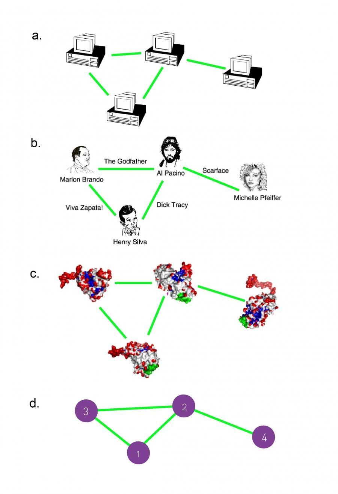
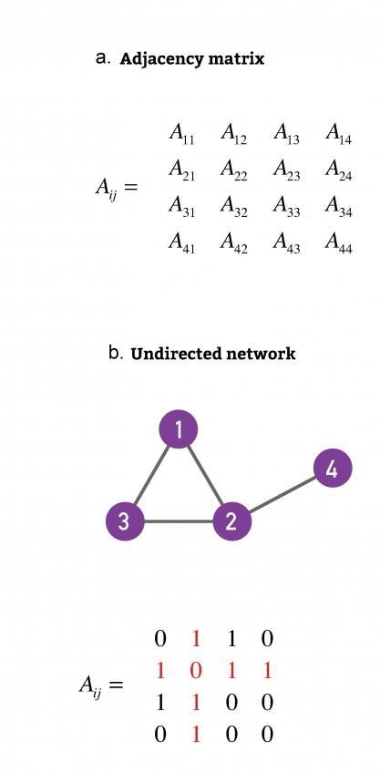
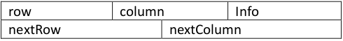
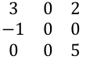
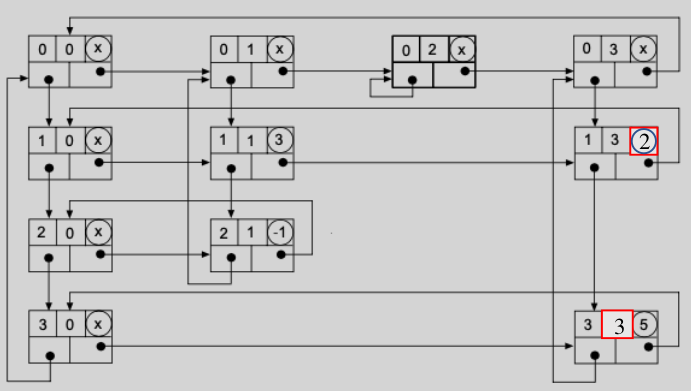

# Sparse Matrix

## Motivation

A network is composed of system’s components often called nodes or vertices and the direct
interactions between them, called links or edges. Figure 1 shows a small subset of (a) the internet,
where routers are connected to each other; (b) Hollywood actor network, where two actors are
connected if they played in the same movie; (c) protein-protein interaction network, where two
proteins are connected if there is experimental evidence that they can bind to each other in the cell.
All different systems have the same network representation using a graph. The number of vertices
in the network is common denoted by N and the number of links by L.

A description of a network requires to track its link. One common representation is by using its
adjacency matrix. The adjacency matrix of the network in Fig. 1 has N rows and N columns, its
elements being (Fig. 2):

* *Aij* = 1 if vertices i and j are connected to each other.
* *Aij* = 0 if vertices i and j are not connected to each other.

Remember that A ij represent the cell of the adjacency matrix in row i and column j. In Fig. 2, we
can observe that there is a link between vertices 1 and 2 because A 1,2 = 1.

In real networks L is much smaller than the maximum number of links in a network. In a network of
N vertices, the maximum number of links is given by:

  

In real networks only a tiny fraction of links in the matrix are nonzero. A matrix which contains very
few non-zero elements are called **sparse matrix**.

  

  

## Project Description

The program use multi-linked circular linked list to represent sparse matrix. A linked list node
is going to store the information of a vertex in the sparse matrix. 
The *node* ***structure*** contain the following information:

* **info**, the information contained in cell of the matrix.
* **row**, the row where info is stored.
* **column**, the column where column is stored.
* **nextRow**, is a pointer to the next node in the same row with relevant information (non-zero).
* **nextColumn**, is a pointer to the next node in the same column with relevant information (non-zero).
  

  

For example, consider the following matrix: 

  

Using the circular linked list, the previous matrix can be represented as Fig. 4. Observe that an extra
row and column are included. All element in the extra row has zero in row and in the extra column
has zero in column. Note that all the cells with zero are not included in the linked list representation
of sparse matrix.

  

