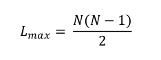

# Sparse Matrix

## Motivation

A network is composed of system’s components often called nodes or vertices and the direct
interactions between them, called links or edges. Figure 1 shows a small subset of (a) the internet,
where routers are connected to each other; (b) Hollywood actor network, where two actors are
connected if they played in the same movie; (c) protein-protein interaction network, where two
proteins are connected if there is experimental evidence that they can bind to each other in the cell.
All different systems have the same network representation using a graph. The number of vertices
in the network is common denoted by N and the number of links by L.

A description of a network requires to track its link. One common representation is by using its
adjacency matrix. The adjacency matrix of the network in Fig. 1 has N rows and N columns, its
elements being (Fig. 2):

* *Aij* = 1 if vertices i and j are connected to each other.
* *Aij* = 0 if vertices i and j are not connected to each other.

Remember that A ij represent the cell of the adjacency matrix in row i and column j. In Fig. 2, we
can observe that there is a link between vertices 1 and 2 because A 1,2 = 1.

In real networks L is much smaller than the maximum number of links in a network. In a network of
N vertices, the maximum number of links is given by:

  

